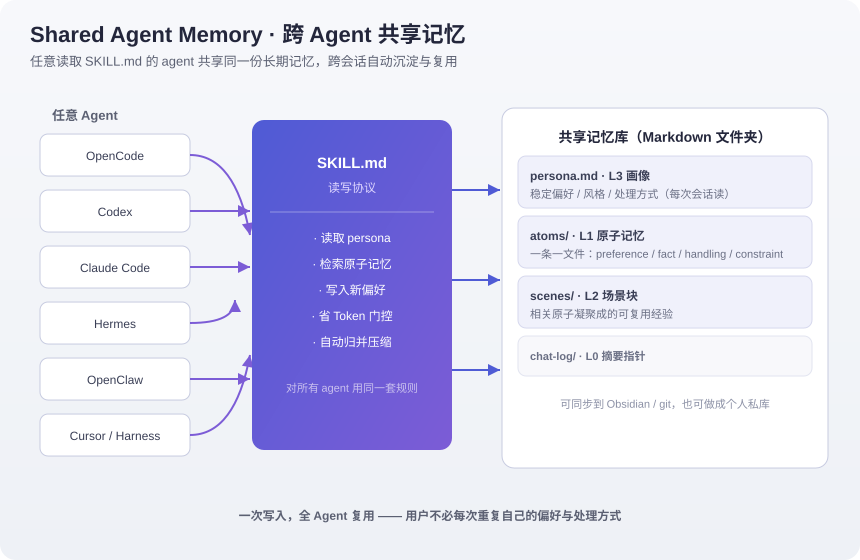
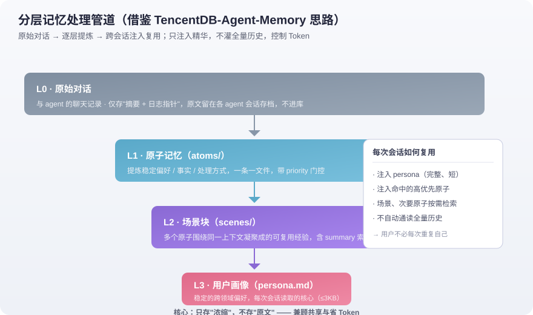

<div align="center">

# 🧠 Shared Agent Memory Skill

**让任意 agent 共享同一份长期记忆 —— 跨会话、跨 agent 自动沉淀与复用**

一个**通用、去平台化**的 Agent 记忆库 Skill。无论你用 Codex、Claude Code、Hermes、OpenClaw、
OpenCode、Cursor 还是各类 Harness，只要它读取标准 `SKILL.md`，就能加载并共享这份记忆。

**"每个 agent 都记住你是谁、你怎么做事，你不用每次重说一遍。"**

</div>

---

## 🎯 它解决什么问题

👋 你有没有这样的经历——**每次用一个 Agent，都要重新交代一遍你是谁、你的项目背景、你偏好怎么做事？**

- 同一个需求，在 Codex 里说过，到 Claude Code 又要再说一遍。
- 上周跑通的流程，这周换个会话就"忘了"，只能翻聊天记录。
- "我是做XX的，我偏好简洁的要点回复，这类改动先给我看方案"——这句话你可能已经打了无数遍。

**Shared Agent Memory 让这一切只发生一次。**

它把"你希望所有 Agent 记住的东西"沉淀成**一份共享记忆库**：任何 Agent 发起任务时按同一套协议
读取它，并在对话中自动把新的稳定偏好写回去。从此——**一次沉淀，全部复用。**

> 你可以把它想象成所有 Agent 共享的"一张关于你的小抄"，而且它会随你的使用自动更新。

---

## 🏗️ 架构总览



> 多个 agent 读取同一份 `SKILL.md` 协议，读写同一份 Markdown 记忆库；用户只维护一份，
> 所有 agent 共享。

---

## 📚 设计参考：分层记忆处理模式

本项目的处理思路借鉴了开源项目
**[TencentDB Agent Memory](https://github.com/TencentCloud/TencentDB-Agent-Memory)** 的
"分层记忆"设计：把对话按 **L0 → L1 → L2 → L3** 逐层提炼，只把精华喂回给 agent，
而不是把原始聊天一股脑塞回去——这样既共享记忆，又省 Token。



### 分层模型对照

| 层级 | 含义 | 本项目落地 |
|---|---|---|
| **L0 · 原始对话** | 与 agent 的聊天记录 | 只存"一句话摘要 + 会话日志指针"，原文留在各自 agent 的会话存档，**不进库** |
| **L1 · 原子记忆** | 一条条稳定的偏好 / 事实 / 处理方式 | `memory/atoms/*.md`，一条一文件，带 `type / priority` 门控 |
| **L2 · 场景块** | 多个原子围绕同一上下文凝聚成的经验 | `memory/scenes/*.md`，含 `summary:` 索引，按需读取 |
| **L3 · 用户画像** | 跨领域的稳定偏好与风格 | `memory/persona.md`，每次会话读取的核心（≤ 3 KB） |

> **与 TencentDB-Agent-Memory 的区别**：Tencent 那套是完整的多组件服务（含 Proxy、知识库、
> 云端存储），本仓库刻意做成**极简、单一 `SKILL.md` + 一个 Markdown 文件夹、零外部依赖**，
> 目的是"拷进任意 agent 的技能目录即可用"，而不是再部署一套服务。

---

## ✨ 特性

- **通用格式**：标准 `SKILL.md` + Markdown 记忆库，任何读 `SKILL.md` 的 agent 都能加载。
- **跨会话 / 跨 agent 共享**：同一份记忆库被不同会话、不同 agent 读取。
- **省 Token**：每次会话只注入 persona + 命中当前任务的高优先原子记忆，绝不灌全量历史；
  原始聊天永不进库；persona 硬阈值 ≤ 3 KB。
- **自动沉淀**：agent 按协议把对话中稳定的偏好提炼成原子记忆，并自动去重、逐层归并到画像。
- **自托管 / 可同步**：记忆库就是普通 Markdown 文件夹，可放本地、同步到你的 Obsidian vault
  或 git 仓库。
- **无平台锁定**：不依赖任何特定 Harness，移走即用。

---

## 🚀 快速开始

```bash
# 1. 克隆 / 拷贝本仓库
git clone <repo-url> agent-memory-skill
cd agent-memory-skill

# 2. 一键安装（自动探测你装的 agent，拷到正确技能目录）
bash install.sh
#    --dry-run: 只显示将装到哪； --target /path: 改装到指定目录

# 3. （手动方式）把 shared-agent-memory 放进你用的 agent 技能根目录（按你用的 agent 选其一）：
#    Codex:        ~/.codex/skills/
#    Claude Code:  ~/.claude/skills/  或 项目 .claude/skills/
#    Hermes:       ~/.hermes/skills/
#    OpenClaw:     ~/.openclaw/skills/
#    OpenCode:     ~/.config/opencode/…/skills
#    Cursor:       项目 .cursor/skills/
#    Harness:      ~/.dsh/skills/  或 项目 skills/

# 4. 编辑 memory/persona.md 和 memory/atoms/，填成你自己的偏好和事实。
#    memory/atoms/ 里有两个 example-*.md 虚构样例，先照此格式写你自己的，再删掉样例。
```

> **快速校验**：新开会话，问你的 agent"是否加载了 shared-agent-memory"。若未出现，
> 确认 `SKILL.md` 首行为 `---`、文件名正确，并重启 agent / 新开会话。

---

## 📁 目录结构

```
shared-agent-memory/
├── SKILL.md                 # 记忆库读写协议（agent 自动加载的入口）
└── memory/
    ├── persona.md           # L3 用户画像（每次会话读取的核心，≤3KB）
    ├── atoms/*.md           # L1 原子记忆（一条一个文件，带 schema）
    ├── scenes/*.md          # L2 场景块
    └── chat-log/*.md        # L0 聊天记录摘要/指针（不进原文）
```

### 原子记忆的 schema 示例

```markdown
---
type: preference | fact | handling | constraint
priority: 1-10      # 越高越重要，主动注入；<=4 仅供按需检索
tags: [可选, 标签]
created: YYYY-MM-DD
updated: YYYY-MM-DD
---
<一句话核心声明>
<可选：一两行补充/由来/示例>
```

`memory/atoms/_template.md` 提供了可直接复制的模板。

---

## ⚙️ 工作原理（TL;DR）

1. **读取**：新会话开始时，agent 读 `persona.md` + 命中当前任务的高优先原子记忆。
2. **写入**：对话中出现稳定的偏好 / 事实 / 处理方式时，按 schema 写原子记忆。
3. **归并**：积累过多时，agent 自动去重、把 2+ 次验证的偏好升到 persona、把过期项降级/删除。

**省 Token 铁律**（详见 `SKILL.md`）：
原始聊天不进库；每次只读 persona + 命中的高优先原子；persona ≤ 3 KB 且超限即压缩；
绝不自动通读全量历史。目标：每次会话自动注入内容恒在 ~1–1.5 KB 内。

---

## 🔁 如何同步 / 备份

记忆库就是普通文件夹，同步方式随你喜欢：

- **Obsidian**：把 `shared-agent-memory/memory/` 软链进你的 vault，即可在 Obsidian 里查看 / 编辑。
- **git**：直接把这个仓库 clone 下来，用 git 管理记忆内容的版本与备份。
- **私有使用**：若记忆含个人信息，请用私有仓库存放 `memory/`，不要推到公开仓库。

---

## 🛡️ 隐私 & 安全

- 本仓库默认 **不含任何真实用户的个人信息**，记忆库以空模板发布。
- **请勿**把含个人真实身份信息（用户名、真实邮箱、绝对路径、凭证）提交到公开仓库。
- 仓库自带 `scripts/pre-push-check.sh` 隐私自检脚本；推送前跑一遍可拦截常见的身份/路径/密钥泄漏。

```bash
bash scripts/pre-push-check.sh   # 退出码 0 表示可安全推送
```

---

## 📄 License

[MIT](LICENSE)

---

<div align="center"><em>Made for anyone who wants their agents to remember — across sessions, across agents.</em></div>
